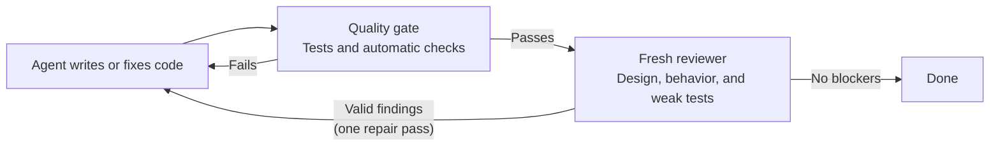

# Agentic Quality Loop

## Why?

[Robert C. Martin](https://en.wikipedia.org/wiki/Robert_C._Martin) (“Uncle Bob”), the author of _Clean Code_ [recently tweeted](https://xcancel.com/unclebobmartin/status/2080257779395154409) about working with coding agents:

> My current strategy is to not read any of the code written by my agents.
> That’s the only way I can take advantage of their productivity. What I do
> instead is to surround the agents with extreme constraints. Unit tests,
> gherkin tests, QA procedures, quality metrics, mutation testing, test
> coverage, and a plethora of others. In the end, I have very high confidence
> in the code they produce because they’ve had to run the gauntlet of all of my
> constraints and tests.
>
> Messy code slows my agents down. I've seen them wrangle with their own messes
> without resolution. I finally had to step in and untangle their own mess. So
> I don't let them create those tangles. I constrain the hell out of function
> sizes, cyclomatic complexity, and test coverage. That seems to keep them
> moving smoothly.


I'm an indie dev and don't know some of these terms, but it sounded close to my approach to working with agents: **minimize direct AI involvement in the pipeline and instead use it for building deterministic script suites**.

Martin's related tools like [`crap4java`](https://github.com/unclebob/crap4java) were a source of inspiration, and here's what I got:

1. **One command checks the work.** Each project gets a single script that runs
   its tests and automatic checks, then clearly passes or fails. This is the
   **quality gate**: the agent must pass it before saying the task is done.

2. **The checks fit the project.** A small project may only need tests and a
   build. Others may add test coverage percentage, cyclomatic complexity (how
   many different paths a function can take), mutation testing (whether tests
   catch deliberately inserted bugs), database checks, or rules about which 
   parts of the app may talk to each other.

3. **A second agent checks what scripts cannot.** After the deterministic checks,
   a different agent reviews it for bad design, weak tests, and behavior mistakes.
   It can report problems, but it cannot edit the code or excuse a failed check.

4. **The first agent gets one repair pass.** It fixes valid findings, runs all
   checks again, then asks the reviewer to verify the fixes one more time.

5. **Every claim needs proof.** The agent cannot just say “tests passed.” It has
   to produce fresh results and report real failures. It must not weaken a
   check simply to get a green result.

6. **It stays local and small.** This is built for one developer on one machine,
   without an enterprise CI.



## Repository layout

The reusable skill is in `skills/agentic-quality-loop`. Development tests live
at repository level so they are not part of the installed skill payload.

## Requirements

- Python 3.10 or newer.
- Git for repository discovery and base-revision handling.
- A POSIX host for non-dry-run use of the bundled universal runner.
- The runtime required by the selected repository gate, such as Bash, Node.js,
  Python, or PowerShell.
- A host capable of creating a genuinely fresh read-only reviewer for the
  independent-review phase.

If a fresh reviewer is unavailable, the deterministic gate remains useful, but
independent-review evidence must be reported as unavailable.

## Install

Clone or download this repository, then link the nested skill into the
[Codex skill discovery directory](https://learn.chatgpt.com/docs/build-skills):

```text
mkdir -p ~/.agents/skills
ln -s /absolute/path/to/agentic-quality-loop/skills/agentic-quality-loop \
  ~/.agents/skills/agentic-quality-loop
```

Copying the directory also works, but a link keeps one canonical copy and
prevents the installed version from drifting away from the repository. Do not
install the same skill name in multiple discovery locations.

## Run

Invoke the skill through the client, or run its universal gate wrapper
directly:

```text
python3 <skill-root>/scripts/run_quality_gate.py \
  --repo <repository-root> --profile auto --base <base-sha>
```

The target repository must expose exactly one supported entrypoint:
`quality/gate`, `quality/gate.sh`, `quality/gate.mjs`, `quality/gate.py`, or
`quality/gate.ps1`.

Non-dry runs are serialized across repositories on the local machine. Output is
capped at 8 MiB, and the private runner log store keeps the current completed
run plus one previous completed run by default. Pass
`--keep-previous-runs <count>` to choose a different bounded history when the
repository gate supports the same option.

## Develop

Validate the skill metadata with the validator bundled with skill-creator, then
run the repository-level tests:

```text
python3 <skill-creator-root>/scripts/quick_validate.py \
  skills/agentic-quality-loop
python3 tests/test_run_quality_gate.py
```

The runner tests use temporary Git repositories and do not require changes to a
real project.
